## 简介

> https://www.yuque.com/docs/share/cab5a749-bd56-4ab3-9e1f-e8b08daa639b?# 《DHA数据库Starter》
>

本文章是介绍一种处理在分布式下主数据库（M）挡掉如何快速让从数据库（S）替换为主数据库的一种Spring Starter实现。

文章的背景是主数据库与从数据库分别部署在A、B两地，在异地多读的基础上提出的一种异地多读的思想，架构图如下：

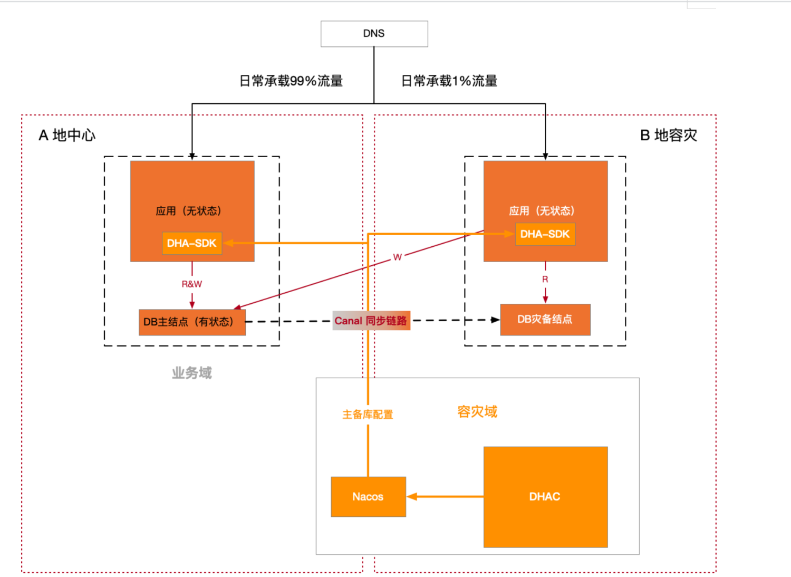

在本项目的设想下，灾备地域机房仅引流1%，其原因是由于数据库层写操作会跨地域访问到原中心，可能会导致请求超时失败等问题，如果引流比例在50%, 保持和同城容灾相同的比例，那么会导致用户的大量请求失败。而之所以引流1%，但不采用温备的方式，是因为如果线上环境一致没有流量，应用本身的可用性无法得到验证，当中心发生地域级故障，需要切换灾备中心时，可能才会发现灾备中心的服务本身也不可用，所以日常态需要线上引流常态化保鲜。

这种方案的好处在于，无需在业务代码层进行任何的容灾改造即可拥有异地单点故障恢复的能力；缺点在于容灾态会有少量的数据不一致，需要业务方做数据订正以及灾备地域的资源利用率不高等问题。

## 具体逻辑

### 正常情况

由上图可知，日常态A地应用读写A地数据库，灾备中心B地应用本地读B地数据库，但写操作会跨地域访问到A地主数据库节点，使用数据同步工具，提供数据库双结点的同步链路以及上报数据同步时间戳到nacos配置中心。两地部署nacos 配置中心，解耦管控面和数据面，并且nacos配置中心以集群模式启动时，其本身具有高可用性；A地和B地两地部署数据库容灾管控系统，该系统分为**数据面**和**管控面**两部分，管控面DHAC (database-console)主要提供数据源的管理以及最重要的是数据源切流的指令下发的管控能力; 数据面DHA-SDK作为DHAC的指令响应方，提供数据源路由规则的计算逻辑以及集成了ORM框架Mybatis和类容器Spring Boot自动配置的能力。

### A地异常

当A地发生故障时，通过DHAC管控面下发数据库角色更高指令，将B地只读数据库切换成读写，并且摘除上层DNS流程对故障地域应用服务的ip解析，实现异地容灾功能

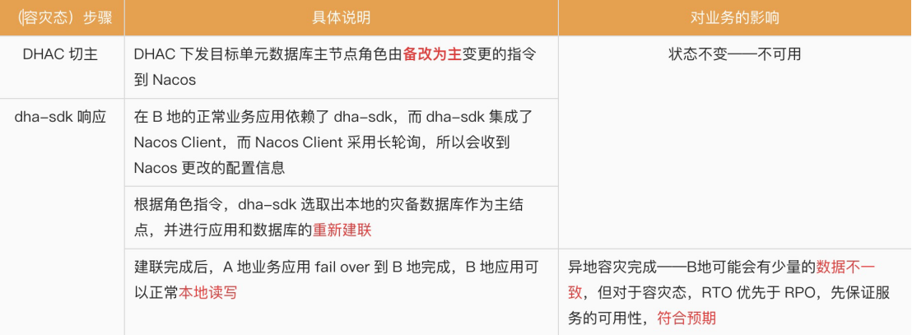

对于真实容灾态，容灾切主步骤非常简单，只需要调用灾备地域的DHAC管控切换数据源角色信息，通过高可用的nacos集群下发指令到两地域的DHA-SDK，通过DHA-SDK的逻辑即可实现异地容灾切换。并且由于nacos配置中心的指令下发链路在容灾机房内是畅通的，所以灾备地域的应用能够实现数据库的快速切换，不会产生任何跨地域的流量访问。另一方面，对于故障发生地域，nacos下发的切流指令虽然会下发失败，但是由于故障发生地域本身并不能继续对外提供服务，可能只有少量的长尾应用的调用（并且内部调用也有可能失败），并不会对容灾地域的应用产生太大影响。

### 主从同步

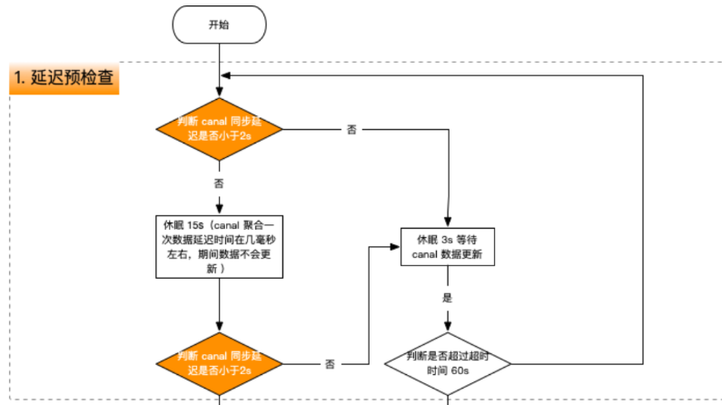

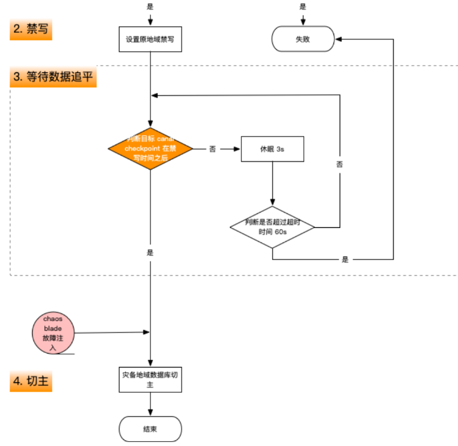

## 具体实现

### 准备数据库

使用广泛的MySQL作为数据源。用 docker 在本机启动两个MySQL数据库，分别对应3304和3305端口，分别用于模拟实现启动在两地域的主数据库和灾备数据库。

### 准备数据同步链路

通过开源MySQL 数据解析和同步工具canal，实现主数据库和灾备数据库之间的异步数据同步，使得在容灾态保证RTO尽可能小的同时，使得RPO可控；

​	canal是阿里巴巴MySQL binlog增量订阅&消费组件，它通过模拟MySQL slave的交互协议，伪装自己为MySQL slave, 向MySQL master 发送dump协议；然后canal解析binary log对象，将数据同步到灾备数据库。

### 准备配置中心

使用nacos的配置中心功能和高可用性，下载 nacos 配置中心作为切流管控指令的下发以及配置的持久化，解耦管控面和数据面，提升DHAC和DHA-SDK的高性能以及高可用性。

### 管控面代码开发（DHAC）

​	实现DHAC数据库容灾切换管控平台，提供数据源的管理能力并且能够进行数据源切换指令的下发。

​	管控端（DHA-SDK）构造一个了appName(业务应用名)映射datasource(数据源)的配置表，并且如果接收到某一应用的数据源切流的http请求，就立刻的将应用名对应的最新数据源的角色配置信息推送到 nacos，然后应用就可以通过DHA-SDK接收到更新的数据源配置信息进而实现数据源的切换。

### 数据面开发（DHA-SDK）

​	实现基于Spring Boot Starter机制的 DHA-SDK，它作为DHAC切流指令的响应方，提供数据源路由规则的计算逻辑以及集成了ORM框架Mybatis和类容器Spring Boot自动配置的能力，从而实现数据源的切换；

​	DHA-SDK 是一个Spring Boot Starter，它的思想是约定大于配置，通过引入写好的 Spring Boot Starter，并且在 application 配置文件中加入对应的配置信息，可以实现对应功能的开箱即用。

​	实现starter 首先需要依赖自动配置注解，然后在resource/META-INF目录下创建spring.factories文件，用于在Spring Boot 启动时，找到其定义的自动加载类，将指定的类初始化为Bean，对于DHA-SDK来说，则是将用户配置的主备数据源信息初始化，用户创建不同主备数据源实例，并且将创建好的数据源实例对象放入 RoutingDataSource存储。有了数据源的基本数据，还需要在建立数据库连接的时候使用到创建的两个数据源，Spring 内置的AbstractRoutingDataSource接口，它的返回值用于获取RoutingDataSource存储的数据源实例；即，如果应用想要获取主数据源，那么就传入主数据源对应的键作为实现AbstractRoutingDataSource接口方法的返回值。并且，通过将应用的全局角色信息保存于一个静态上下文类中，用于保存全局数据源的角色信息。

​	实现读写分离的功能是结合Mybatis的Plugin机制实现的。Mybatis提供了一个Interceptor接口，通过实现这个接口，可以自定义在Mybatis执行器的执行，参数的处理，结果集的处理和SQL语法的构建这四个过程具体的执行逻辑。在DHA-SDK中，通过拦截执行器，得到SQL类型，当识别出SQL是查询的读操作，就遵循同地域优先的原则，根据应用的 region 信息，本地读数据库，而如果发现是增删改等写操作，那么就会路由到主数据库进行单点写入，从而实现读写分离功能。其具体读写操作对应的主备数据库信息存入当前线程的ThreadLocal 变量，当Spring通过determineCurrentLookKey方法找到当前数据源时，再将本线程中ThreadLocal 变量存储的值取出，进而路由到对应的数据源datasource，并进行数据库的建连。

## 结果演示

### 数据库配置

由于实际选取跨地域机房成本比较高，测试过程是通过 docker 容器隔离模拟实现两地应用和数据库运行的。MASTER地域对应是原中心A地，STANDBY地域对应灾备中心B地。

下面分别是A、B数据库对应的数据

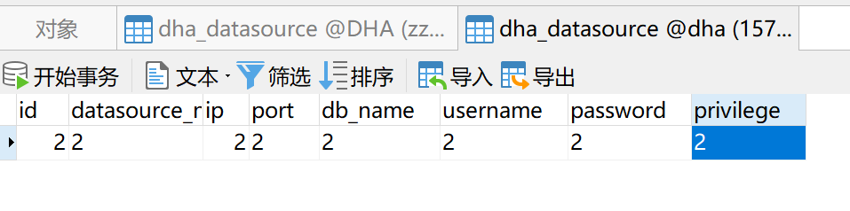

首先启动demo服务，同时设置此次服务为B地服务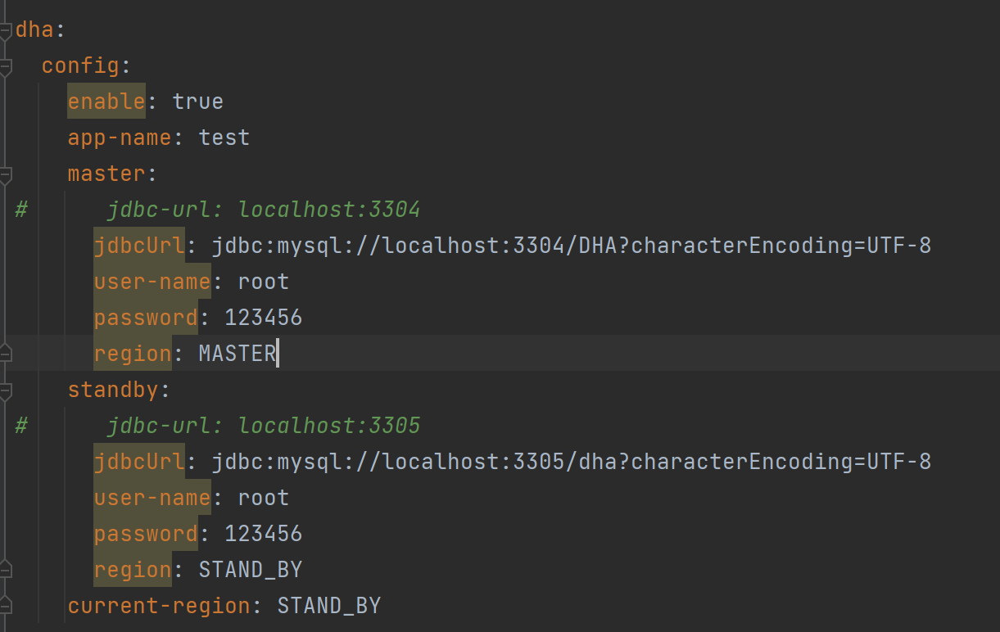

### 启动Nacos

使用A为主数据库

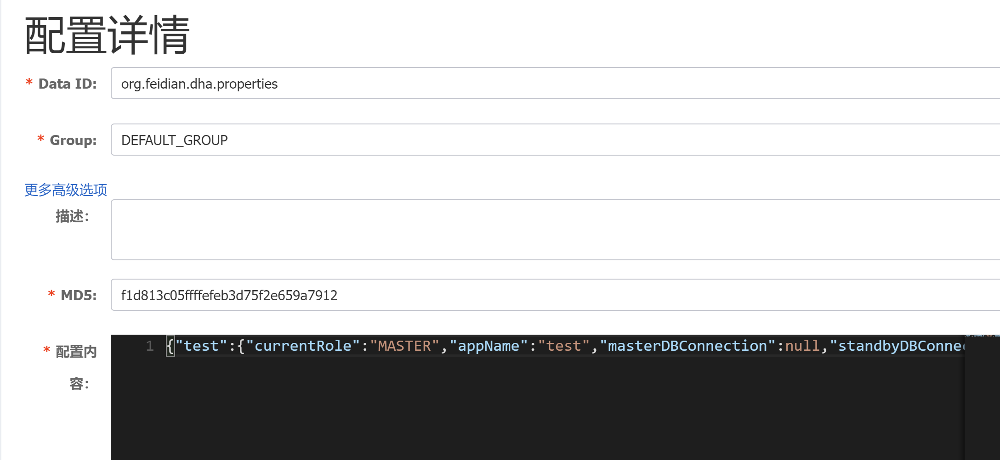

查询数据库的第一条数据，结果如下：

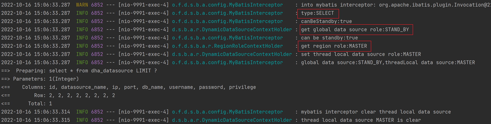

从图中可以看出，当前全局角色是STANDBY, 而当前region配置的是MASTER, 对于读操作，默认都走同地域优先，所以会找到MASTER节点对应的数据源，找到结果为id=2的数据

### 进行主备节点的切换

向DHAC数据管控发送切流指令，切换short_url_demo应用的数据源主备角色，从STANDBY切换至MASTER, DHAC 接收到请求之后，更改Nacos 配置，Nacos 则下发配置到当前应用，可以看到全局数据源角色已经改变：

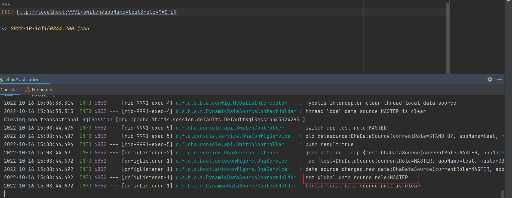

继续查询数据库中第一条数据，发现虽然全局数据库为A，但是查询操作仍然走的是B数据库：

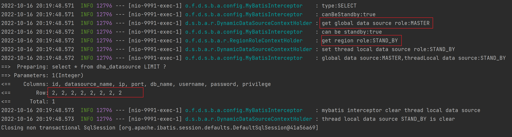

### 读写分离

执行插入测试，会走到全局数据源配置的B地节点，并且插入数据成功	

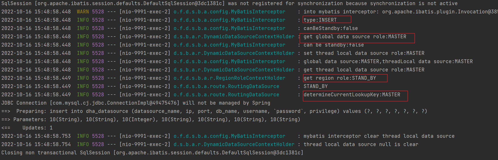

除查询操作外所有对B数据库的操作都将流向A数据库，实现读写分离，切换数据源角色信息链路是DHAC-> nacos -> DHA-SDK, 全局数据源角色信息更新

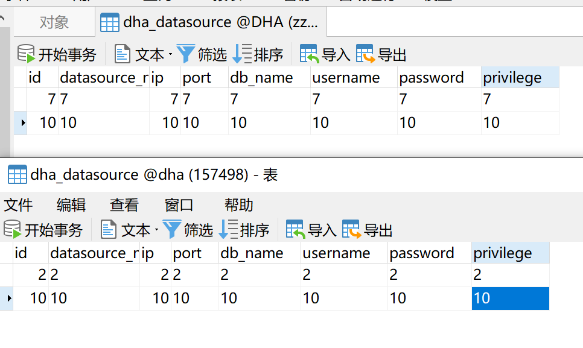

## 未来的改进

整个项目只是本人对于数据库容灾恢复的一种思考，由于实际选取跨地域机房成本比较高，测试过程是通过 docker 容器隔离模拟实现两地应用和数据库的运行，测试结果目前只涉及到功能层面没有问题，但是如果在实际生产环境使用，需要考虑代码安全性以及高延迟导致的业务失败场景，以及在容灾态场景下，切换数据库导致的数据不一致的数据修复工作，同时对于上层的DNS服务并未测试，只能手动模拟实际情况。但我认为只要我在这个项目中学习到新的知识就可以了，最终的结果相对于过程并没有那么重要。
